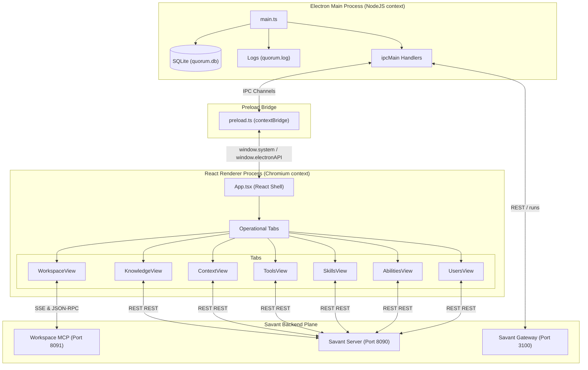

# Savant Olympus Baseline Documentation

Welcome to the **Savant Olympus** (internally configured as **Savant Quorum**) baseline documentation. This document serves as the unified, comprehensive blueprint for the application's runtime architecture, data boundaries, module dependencies, API integrations, build pipelines, and testing suites as of June 2026.

---

## 1. System Overview & Product Boundary

Savant Olympus is the desktop Command & Control interface for the Savant ecosystem. It packages a React-based frontend inside an Electron container, communicating with local and remote Savant core services via REST APIs, Server-Sent Events (SSE), and Electron Inter-Process Communication (IPC).

### Core Philosophy & Boundary Constraints
*   **UI-Only surface**: Olympus is strictly designed as a control panel and telemetry surface. It does not contain core agent execution engines or local language models; those are delegated to the Savant Server or Savant Gateway.
*   **No local conversation history**: Unlike traditional chat-centric clients, Olympus does not manage message logs, chat transcripts, or chat-related SQLite schemas (such as `messages` or `sessions`). Any naming patterns resembling `ChatArea`, `ChatMarkdown`, or local chat handlers are explicitly out of scope.
*   **Operational Tabs**: The primary workflow is structured around specialized control surfaces, each mapping to a distinct operational dimension of the Savant agent environment.

---

## 2. Technical Stack

| Category | Technology | Description |
| :--- | :--- | :--- |
| **Runtime Shell** | Electron 31.0.0 | Hosts the application main process and preload bridge, granting native OS capabilities. |
| **Frontend Core** | React 18.2.0 & TypeScript | Drives the UI components and application shell. |
| **Bundling & Dev Server** | Vite 8.0.16 | Manages hot module replacement and client-side builds. |
| **Styling** | Tailwind CSS 4.1.12 | Handles style tokens and layout rules. |
| **Local Persistence** | SQLite via `better-sqlite3` | Used by the main process for persistent settings. |
| **Visualizations** | D3.js 7.9.0 | Drives interactive knowledge graphs and complex AST radial trees. |
| **Flow Diagrams** | Mermaid.js 11.15.0 | Renders dynamic sequence and architectural diagrams. |
| **Telemetry & Metrics** | Recharts 2.15.2 | Visualizes system resource metrics, latency, and throughput. |
| **Test Runner** | Vitest 4.1.7 & JSDOM | Executes tests in simulated browser contexts. |

---

## 3. High-Level Architecture & Process Model

Olympus follows the standard Electron multi-process model:



---

## 4. Directory & Module Breakdown

### 📂 Main Process (`src/main/electron/`)
*   [main.ts](file:///Users/home/code/project-x/savant-olympus/src/main/electron/main.ts): Configures and spawns the `BrowserWindow` and desktop tray icon, overrides console loggers to write to `~/.savant/quorum.log`, initializes the SQLite database engine, hosts provider and model discovery, and handles IPC.
*   [preload.ts](file:///Users/home/code/project-x/savant-olympus/src/main/electron/preload.ts): Forms the context-isolated bridge between Chromium and NodeJS. Exposes type-safe helper functions on the global object.

### 📂 React Shell (`src/renderer/`)
*   [main.tsx](file:///Users/home/code/project-x/savant-olympus/src/renderer/main.tsx): Mounts the React application. Provides mock implementations of Electron bridge APIs to facilitate standalone browser development.
*   [App.tsx](file:///Users/home/code/project-x/savant-olympus/src/renderer/App.tsx): Manages authentication state against the Savant Server, triggers initial gateway connection status, manages settings propagation, and routes between active tabs.

### 📂 Operational Tab Components (`src/renderer/components/tabs/`)
1.  [WorkspaceView.tsx](file:///Users/home/code/project-x/savant-olympus/src/renderer/components/tabs/WorkspaceView.tsx):
    *   Exposes 13 core MCP tools (such as task management, workspaces creation, session note auditing, Jira tickets, and merge requests).
    *   Sets up an SSE client, listening on a dynamic port returned by the server, to perform JSON-RPC communication for tool calls.
2.  [KnowledgeView.tsx](file:///Users/home/code/project-x/savant-olympus/src/renderer/components/tabs/KnowledgeView.tsx):
    *   Visualizes knowledge nodes and semantic connections using D3 force simulations.
    *   Includes cluster-gravity force fields, domain hulls, focal search, exploration depth (BFS), node merging, and import/export utilities.
3.  [ContextView.tsx](file:///Users/home/code/project-x/savant-olympus/src/renderer/components/tabs/ContextView.tsx) & [ContextVisualizations.tsx](file:///Users/home/code/project-x/savant-olympus/src/renderer/components/tabs/ContextVisualizations.tsx):
    *   Registers local directories or remote Git projects, handles indexing telemetry, and triggers Abstract Syntax Tree (AST) generators.
    *   Visualizes code details via D3 AST radially styled tree layouts, radial clusters, and complexity heatmaps.
4.  [ToolsView.tsx](file:///Users/home/code/project-x/savant-olympus/src/renderer/components/tabs/ToolsView.tsx):
    *   Exposes a sandbox playground for querying and running general registered MCP tools.
5.  [SkillsView.tsx](file:///Users/home/code/project-x/savant-olympus/src/renderer/components/tabs/SkillsView.tsx):
    *   Displays verified capability assertions that are cryptographically signature-audited for autonomous actions.
6.  [AbilitiesView.tsx](file:///Users/home/code/project-x/savant-olympus/src/renderer/components/tabs/AbilitiesView.tsx):
    *   Browses and edits prompt assets (Personas, Rules, Policies, Styles, and Repos).
    *   Features a resolution panel builder that compiles these rules into finalized prompt blueprints.
7.  [UsersView.tsx](file:///Users/home/code/project-x/savant-olympus/src/renderer/components/tabs/UsersView.tsx):
    *   Renders and manages active operator details, roles (Admin, Operator, Guest), and API authorization keys.

### 📂 Shared UI and Layouts (`src/renderer/components/`)
*   [LeftSidebar.tsx](file:///Users/home/code/project-x/savant-olympus/src/renderer/components/LeftSidebar.tsx): Primary tab navigation and profile/settings access.
*   [RightPanel.tsx](file:///Users/home/code/project-x/savant-olympus/src/renderer/components/RightPanel.tsx): Drawer for context-sensitive metrics, real-time log trace streams, agent interaction topologies, semantic searches, and index code exploration.
*   [TopBar.tsx](file:///Users/home/code/project-x/savant-olympus/src/renderer/components/TopBar.tsx) & [BottomBar.tsx](file:///Users/home/code/project-x/savant-olympus/src/renderer/components/BottomBar.tsx): Display database connectivity status, dynamic latency updates, active operator name, and app controls.
*   [FileBrowserModal.tsx](file:///Users/home/code/project-x/savant-olympus/src/renderer/components/FileBrowserModal.tsx): Handles server-side directory navigation for repository registration.

---

## 5. Persistence, State, & IPC Contracts

### Local SQLite Persistence (`quorum.db`)
Stored at `~/.savant/quorum.db`. Configured via `better-sqlite3`:
*   **Table**: `settings`
    *   `key TEXT PRIMARY KEY`: Setting identifier (e.g. `gateway:config`, `server:config`, `user:apiKey`, `user:name`).
    *   `value TEXT`: Plaintext value or stringified JSON payload.

### IPC Communication Channels
Exposed via [preload.ts](file:///Users/home/code/project-x/savant-olympus/src/main/electron/preload.ts):

```typescript
// System API namespace
window.system = {
  getUser: () => Promise<string>,                   // Returns OS username
  listProviders: (url?: string) => Promise<any>,    // Gathers model/provider info
  getSettings: () => Promise<Record<string, any>>,  // Retrieves settings key-value rows
  saveSetting: (key: string, val: any) => Promise<boolean>, // Saves/updates row
  getDbStatus: () => Promise<string>,               // Returns database status ('connected' / 'offline')
}

// OS Filesystem API namespace
window.electronAPI = {
  pickDirectory: (defaultPath?: string) => Promise<string | null>, // Opens native directory dialog
  listDirectory: (dirPath: string) => Promise<any[]>,            // Lists folder entries (filters node_modules/hidden files)
}
```

---

## 6. Savant Core API Integrations

The application communicates with the external backend plane using the following endpoint configurations:

### 1. Savant Server Plane (Default: `http://127.0.0.1:8090`)
All server requests require `X-API-Key` authentication headers.
*   **Authentication**: `GET /api/auth/validate`
*   **Operators**: `GET /api/auth/operators`
*   **Context & Code Indexing**:
    *   `GET /api/context/repos` — Lists active repositories.
    *   `POST /api/context/repos` — Registers a new repository.
    *   `DELETE /api/context/repos/:repo` — Deletes a project registration.
    *   `POST /api/context/repos/index` — Triggers repository vector/chunk indexing.
    *   `POST /api/context/repos/stop` — Stalls/cancels indexing.
    *   `POST /api/context/repos/purge` — Removes indexed vectors.
    *   `POST /api/context/repos/ast/generate` — Begins AST parser.
    *   `GET /api/context/repos/indexing-status` — Fetches active job progressions.
    *   `GET /api/context/repos/sources` — Resolves supported server configurations.
    *   `GET /api/context/ast/list?repo=...` — Retrieves code node symbols.
    *   `GET /api/context/code/list?repo=...` — Lists absolute code filenames.
    *   `GET /api/context/code/read?uri=...` — Reads raw codebase files.
    *   `GET /api/context/search?q=...&repo=...` — Performs semantic embedding search queries.
    *   `GET /api/context/memory/list?repo=...` — Identifies active memory banks.
    *   `GET /api/context/memory/read?uri=...` — Reads memory resource files.
*   **Knowledge Graph**:
    *   `GET /api/knowledge/graph` — Retrieves nodes and edges data.
    *   `GET /api/knowledge/nodes/:id` — Inspects detailed node summaries.
    *   `POST /api/knowledge/nodes` — Spawns new graph node configurations.
    *   `DELETE /api/knowledge/nodes/:id` — Removes targeted nodes.
    *   `POST /api/knowledge/nodes/merge` — Merges node elements.
    *   `POST /api/knowledge/nodes/bulk-delete` — Deletes node groups.
    *   `POST /api/knowledge/edges` — Maps new edge links.
    *   `POST /api/knowledge/edges/bulk` — Links one node to multiple targets.
    *   `POST /api/knowledge/purge-workspace` — Resets workspace node layouts.
    *   `POST /api/knowledge/prune` — Cleans orphaned links.
    *   `GET /api/knowledge/export` — Exports graphs to JSON files.
    *   `POST /api/knowledge/import` — Imports JSON graph data.
*   **Abilities Assets**:
    *   `GET /api/abilities/assets` — Lists prompt configurations.
    *   `GET /api/abilities/assets/:id` — Details specific rules/personas.
    *   `PUT /api/abilities/assets/:id` — Saves modifications.
    *   `DELETE /api/abilities/assets/:id` — Removes asset entries.
    *   `POST /api/abilities/assets` — Creates custom rules.
    *   `POST /api/abilities/resolve` — Compiles and resolves tags and personas.
    *   `POST /api/abilities/bootstrap` — Generates default assets.
    *   `GET /api/abilities/validate` — Validates format rules.
    *   `GET /api/abilities/skills` — Gathers capability registry lists.
*   **MCP Server Configuration**:
    *   `GET /api/mcp/tools` — Lists tool profiles.
    *   `POST /api/mcp/tools/run` — Executes tools directly on the backend.
    *   `GET /api/mcp/health/workspace` — Resolves the workspace SSE port.

### 2. Savant Gateway & Agent Execution Plane (Default: `http://127.0.0.1:3100`)
Handled by the Electron Main Process:
*   **Endpoint Health**: `/health` (Health verification)
*   **Agent Execution**:
    *   `POST /runs` (Triggers an agent runner execution with bearer authentication)
    *   `GET /runs/:id` (Polls status updates until execution resolves to complete/failed)

### 3. Server-Sent Events (SSE) Workspace Connection (Default Port: `8091`)
*   **URL**: `http(s)://127.0.0.1:<port>/sse?api_key=<api_key>&session_id=<session_id>`
*   **Protocol**: Exchanges JSON-RPC 2.0 frames (`initialize` request, `endpoint` response, and `tools/call` response).

---

## 7. Tooling, Configs, & Development Scripts

### Command Definitions
*   `npm run dev`: Executes `node scripts/start-electron-dev.mjs --with-renderer`. Compiles main/preload via Vite under development modes, triggers the renderer server, and spawns Electron pointing to `http://127.0.0.1:5174/`.
*   `npm run dev:renderer`: Spawns Vite renderer server independently on port 5174 without Electron.
*   `npm run dev:electron`: Builds main/preload scripts and launches Electron.
*   `npm run build`: Performs complete TypeScript compilations (`tsc`), bundles renderer packages, and triggers package installers via `electron-builder`.
*   `npm test`: Executes vitest verification runs.

### Configuration Blueprints
*   [vite.config.mts](file:///Users/home/code/project-x/savant-olympus/vite.config.mts): Sets the root workspace to `src/renderer`, configures output paths to `./dist` and `./dist-electron`, enables `@tailwindcss/vite` injection plugins, and handles native CommonJS package exclusions.
*   [vite.electron.config.mts](file:///Users/home/code/project-x/savant-olympus/vite.electron.config.mts): Library configuration targeting main and preload scripts. Externalizes system dependencies (`electron`, `better-sqlite3`, `node:child_process`, etc.).
*   [tsconfig.json](file:///Users/home/code/project-x/savant-olympus/tsconfig.json): TypeScript compiler rules, target parameters (`ESNext`), module resolution behaviors (`bundler`), and path aliases.

---

## 8. Verification & Test Architecture

### Testing Strategy
Olympus tests run inside **Vitest** in a mock **JSDOM** environment. Mocks are configured in [src/renderer/test/setup.ts](file:///Users/home/code/project-x/savant-olympus/src/renderer/test/setup.ts):
*   **Mermaid Mock**: Stubs Mermaid flow layouts to prevent canvas crashes.
*   **Electron Preload Mock**: Injects fake `window.system` and `window.ipcRenderer` handlers.
*   **LocalStorage Mock**: Pre-seeds authentication keys (`savant_api_key`).
*   **Global Fetch Mock**: Intercepts authentication request checks, returning success mock validation signatures.

### Test Files Index
*   [App.test.tsx](file:///Users/home/code/project-x/savant-olympus/src/renderer/test/App.test.tsx): Tests authenticated booting flows and default views rendering.
*   [Tabs.test.tsx](file:///Users/home/code/project-x/savant-olympus/src/renderer/test/Tabs.test.tsx): Validates view tabs (Tools, Skills, Users, Abilities, Workspace) and RightPanel event listeners.
*   [ContextView.test.tsx](file:///Users/home/code/project-x/savant-olympus/src/renderer/test/ContextView.test.tsx): Verifies repository creation forms and local filesystem navigation drawers.
*   [ContextAnalysis.test.tsx](file:///Users/home/code/project-x/savant-olympus/src/renderer/test/ContextAnalysis.test.tsx): Asserts mathematical correctness of AST symbol complexity heuristics.
*   [KnowledgeView.test.tsx](file:///Users/home/code/project-x/savant-olympus/src/renderer/test/KnowledgeView.test.tsx): Tests graph load triggers, node generation controls, and D3 visualization layouts.
*   [AuthAndShell.test.tsx](file:///Users/home/code/project-x/savant-olympus/src/renderer/test/AuthAndShell.test.tsx): Tests storage layers, modals (Profile, Settings), and the application main layout shell.
*   [Mermaid.test.tsx](file:///Users/home/code/project-x/savant-olympus/src/renderer/test/Mermaid.test.tsx): Exercises SVG layout wrapper rendering.

---

## 9. Baseline Heuristics & Key Quality Areas

*   **React Act Warnings**: Several test files output `act(...)` warning logs during state changes in Abilities and Workspace views. Future maintenance should wrap these update vectors properly.
*   **Bundling Optimization**: The packaged renderer bundle sizes exceed `990 kB`, mainly due to D3.js configurations. Applying code-splitting principles around the D3-heavy pages (`KnowledgeView.tsx`, `ContextVisualizations.tsx`) is highly recommended for future updates.
*   **Fallback Data**: The tools, skills, users, and abilities interfaces mock fallback data structures when their backend HTTP endpoints are offline. Developers should confirm whether failures in tests occur on fake mock values or are actual server integration regressions.
