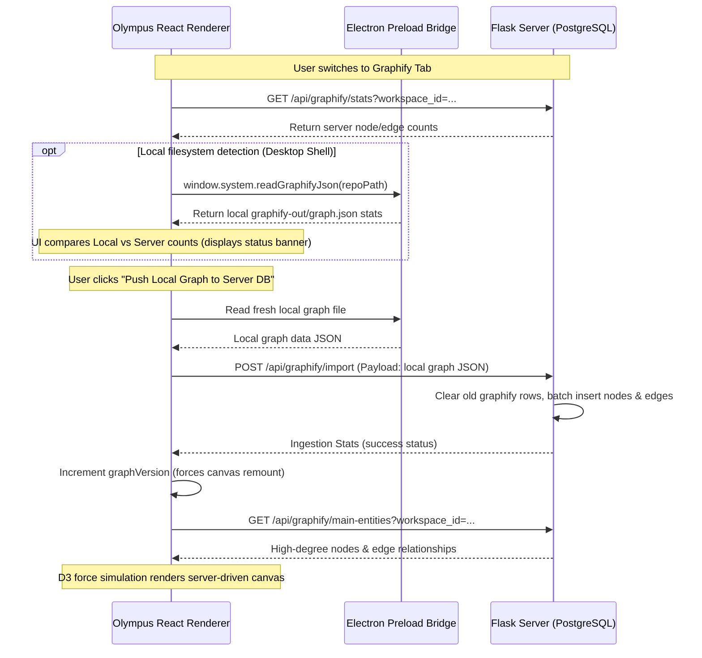

# PRD & Implementation Status: Codebase Graph (Graphify) Integration

This document serves as the Handover PRD and Technical Specification for the Graphify codebase-level graph visualization and query feature. It details the project goals, what has been implemented, how it works, and the remaining verification steps.

---

## 1. Project Goal
Integrate **Graphify** (from `safishamsi/graphify`) as a standalone codebase architecture visualizer and structural search tool.
*   **Storage**: Save codebase graphs in production PostgreSQL databases (independent of the general Knowledge Graph).
*   **MCP Integration**: Expose codebase-scoped graph searches to AI agents via FastMCP on port `8096`.
*   **Visual Representation**: Render the codebase as an interactive, selectable, zoomable 3D-styled D3 canvas inside Olympus UI.
*   **Sync Logic**: Offer a clean front-end banner/toolbar to push local `graphify-out/graph.json` files to the PostgreSQL database, ensuring the canvas is driven by server data.

---

## 2. What Has Been Done

### A. PostgreSQL Database Layer (savant-server)
*   **Schema Configured** ([postgres_client.py](file:///Users/home/code/project-x/savant-server/postgres_client.py)):
    *   `graphify_nodes`: Primary key `node_id`. Stores metadata properties in JSONB, including title, node type (`class`, `function`, `method`, `file`), and optional description.
    *   `graphify_edges`: Foreign keys map `source_id` and `target_id` back to nodes, storing structural relations (`calls`, `imports`, `inherits`, `depends_on`).
*   **DB Client Helpers** ([db/graphify.py](file:///Users/home/code/project-x/savant-server/db/graphify.py)):
    *   `import_graph`: Cleans old graph database entries for the workspace before importing new ones. Automatically verifies foreign key integrity.
    *   `get_stats`: Aggregates nodes and edges grouped by type.
    *   `search`: Performs case-insensitive wildcard pattern matching on titles and content (optionally scoped to a workspace).
    *   `get_neighbors`: Returns a specific node's surrounding neighborhood topology.
    *   `get_main_entities`: Fetches the highest degree (most connected) nodes to bootstrap the initial D3 canvas without overloading it.

### B. REST Endpoints (savant-server)
*   **API Blueprint** ([graphify/routes.py](file:///Users/home/code/project-x/savant-server/graphify/routes.py)):
    *   `POST /api/graphify/import`: Ingests graph JSON payload and optional file metadata JSON dictionary. Merges file hashes/hashes details directly into node records and saves the raw dictionary to the global key-value store.
    *   `GET /api/graphify/stats`: Returns workspace node/edge statistics.
    *   `POST /api/graphify/search`: Scans database nodes.
    *   `GET /api/graphify/main-entities`: Fetches initial skeleton nodes.
    *   `GET /api/graphify/neighbors`: Loads neighbors on request.
*   Registered the blueprint in [app.py](file:///Users/home/code/project-x/savant-server/app.py).

### C. FastMCP Server Tools (savant-server)
*   **MCP Service** ([mcp/graphify_server.py](file:///Users/home/code/project-x/savant-server/mcp/graphify_server.py)):
    *   Exposes `search_graphify(query, workspace_id)` (workspace scoping preferred but global allowed) and `get_graphify_stats(workspace_id)`.
    *   Runs as an SSE server on port `8096`. Configured in [mcp-config.json](file:///Users/home/code/project-x/savant-server/mcp-config.json) and [mcp_servers.toml](file:///Users/home/code/project-x/savant-server/mcp_servers.toml).
*   **Orchestration**: Updated `docker-compose.yml`, `Dockerfile`, and `docker-entrypoint.sh` to start and expose port `8096`.
*   **Docker Container**: Image is rebuilt, running, and healthy.
*   **Health Checks**: Updated endpoints in [app.py](file:///Users/home/code/project-x/savant-server/app.py) to output `{"status": "ok", "version": "2"}` on `/health/live` and `/health/ready`.

### D. Electron Preload & Front-End UI (savant-olympus)
*   **IPC Bridge** ([preload.ts](file:///Users/home/code/project-x/savant-olympus/src/main/electron/preload.ts), [main.ts](file:///Users/home/code/project-x/savant-olympus/src/main/electron/main.ts)):
    *   Exposes `window.system.readGraphifyJson(repoPath)` to read local `graphify-out/graph.json` data securely from the client filesystem.
*   **Renderer Components** ([ContextView.tsx](file:///Users/home/code/project-x/savant-olympus/src/renderer/components/tabs/ContextView.tsx)):
    *   Uses strict type checking (`typeof window.system?.readGraphifyJson === 'function'`) to prevent errors in browser testing or prior to compilation.
    *   **Directory Picker**: Displays a permanent **SELECT GRAPHIFY DIR** button opening a directory selection window. Automatically scans the selected folder recursively for JSON files (graph structure and file manifest).
    *   Pushes local graph files **on-demand** when the sync or push buttons are clicked, refreshing the stats immediately.
    *   Increments a `graphVersion` React key to force-reload the interactive canvas automatically once data is pushed to PostgreSQL.
*   **D3 Visualizer** ([GraphifyVisualizer.tsx](file:///Users/home/code/project-x/savant-olympus/src/renderer/components/tabs/GraphifyVisualizer.tsx)):
    *   An interactive, zoomable, drag-selectable D3 canvas showing relationships between classes, functions, and files.
    *   Uses lazy-loading: initial load is limited to the top 40 main entities; clicking on a node dynamically queries and attaches its neighboring structure.
    *   Includes a sidebar **Entity Inspector** to display markdown docstrings, attributes, and variables.

---

## 3. How It Works

---

## 4. Pending / Next Steps for Incoming Agent

Since the server stack is rebuilt, healthy, and all 47 renderer tests pass (`npm test -- --run` runs successfully), the remaining work is verification within the runtime shell:

1.  **Electron Shell Execution**:
    *   Run `npm run dev` to start the Electron desktop shell with the local renderer.
    *   Navigate to the Context View tab, register a repository, and inspect if `readGraphifyJson` correctly parses the local `graphify-out/graph.json`.
2.  **Verify Sync Button**:
    *   Create or update a local `graphify-out/graph.json` file in a codebase.
    *   Verify that the "Push Local Graph to Server DB" button loads, correctly clears old DB rows, and pushes the new graph.
3.  **Confirm Visualizer Interaction**:
    *   Open the Codebase Graph (Graphify) tab.
    *   Verify that clicking nodes requests neighbors from `GET /api/graphify/neighbors` and appends them to the live simulation without jumping or lagging.
    *   Confirm the Sidebar Inspector successfully renders class metadata and attributes.
4.  **Production Compilation**:
    *   Run `npm run build` to compile the renderer and package the Electron main/preload scripts. Ensure the assets pack cleanly and no typescript types clash.
